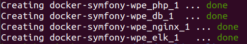

# Docker Symfony (PHP7-FPM - NGINX - MySQL - ELK)

This repository builds upon https://github.com/maxpou/docker-symfony.

By following the installation steps below, it is possible to view a local version of the World Parliament Experiment website. This allows to change the website's content and test new features before they are deployed to the actual website.

# Installation

## Ubuntu

### Prerequisites
- Ubuntu 16.04 LTS or newer (https://ubuntu.com/download)
- Git version control: `$ sudo apt-get install git`
- Docker (Installation: https://docs.docker.com/engine/install/ubuntu/)
- Docker Compose (Installation: https://docs.docker.com/compose/install/)

### Installation procedure
1. Create folder "world-parliament", e.g. in your home directory `/home/$USER/`
    ```bash
    mkdir world-parliament
    ```

2. Switch to the created directory
    ```bash
    cd world-parliament
    ```
    From now on, we will call this directory
    ```bash
    $WPE_ROOT
    ```
    
    When you encounter `$WPE_ROOT` in this readme, then you will need to replace it with the location of your folder `world-parliament`, e.g. `/home/$USER/world-parliament`

3. Clone the WPE repository which contains all the website's code
    ```bash
    cd $WPE_ROOT
    git clone https://github.com/world-parliament-experiment/WPE.git
    ```

4. Clone the docker-symfony-wpe repository which allows to test the website's code in a docker container.
    ```bash
    cd $WPE_ROOT
    git clone https://github.com/world-parliament-experiment/docker-symfony-wpe.git
    ```

5. Build the docker images. When done for the first time, this will take some time because parts of the images have to be downloaded from the internet first.
    ```bash
    cd $WPE_ROOT/docker-symfony-wpe
    docker-compose build
    ```

6. Build, (re)create, start, and run the containers in detached mode (`-d`) / in the background (This may as well take some time).
    ```bash
    cd $WPE_ROOT/docker-symfony-wpe
    docker-compose up -d
    ```
    When succussfull, you should see this:

    

7. You can list running docker containers using the following command. It should list four running containers.
    ```bash
    docker ps
    ```

8. We later want to open the local wpe website through its name and not through its IP address. That's why we tell the computer what IP address to open when we use the name of the local wpe website in our browser. We choose the the name `wpe.local`. We add the name and the corresponding IP Adress to the list of known hosts. To do so, we need to be in a root shell:
    ```bash
    sudo su
    ```

    Now, we can add the IP address and the name to the hosts file.
    ```bash
    echo $(docker network inspect bridge | sudo grep Gateway | sudo grep -o -E '([0-9]{1,3}\.){3}[0-9]{1,3}') "wpe.local" >> /etc/hosts
    ```

    Make sure to exit the root shell by pressing `Ctrl + D`

    To check whether this was successfull, you can now open [wpe.local](wpe.local) in you browser. When succusfull, a website will open which - among other things - shows you an error message like 

    `( ! ) Warning: require(/var/www/symfony/web/../vendor/autoload.php): failed to open stream: No such file or directory in /var/www/symfony/web/app.php on line 5`

    The website is not properly running yet, so don't worry.

9. Attach to the running php docker container and open the command line interpreter bash
    ```bash
    cd $WPE_ROOT/docker-symfony-wpe
    docker-compose exec php bash
    ```

    You are now "inside" the docker container at location `/var/www/symfony# `

10. While inside the docker container, we will use the software Composer (https://getcomposer.org/doc/00-intro.md) to install libraries which our project depends on. In order to use composer to install the dependencies, run
    ```bash
    composer install
    ```
    
11. Still inside the docker container, we will now use Doctrine in order to automatically create all the database tables needed for every known entity in our application.
    ```bash
    sf3 doctrine:schema:update --force
    ```

12. Still inside the docker container, we will use so-called Fixtures. These Fixtures are used to load a “fake” set of data into a database that we can then use for testing and give us some interesting data while we are developing our application.
    ```bash
    sf3 doctrine:fixtures:load --no-interaction
    ```
    
13. Make sure to exit the docker container by pressing `Ctrl + D`

14. The web server we started employs a user named `www-data` to access files. We need to give this user permission to do so.
    ```bash
    cd $WPE_ROOT/WPE
    sudo chown -R www-data:www-data var/
    ```

You can now open wpe.local in your browser. This should show you the WPE website, as currently set up by the code in your local WPE repository `$WPE_ROOT/WPE`
